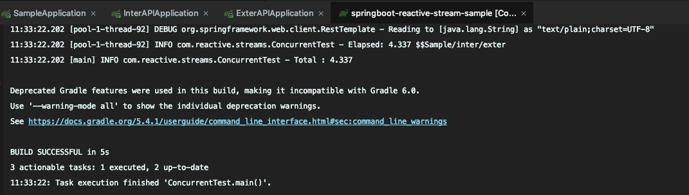

# springboot-reactive-stream-sample

java 8
spring webFlux

외부 API 연동 관련 처리 속도 확인.

SampleApplication 의 `GET /call` API 호출이 메인.

# 전체적인 테스트 관련사항

SampleApplication의 thread는 1개로 고정한 뒤 webFlux를 이용하여 동시 100번 요청을 보냈을 떄 처리 속도를 확인하려 한다.

# 흐름도

1번 케이스

`GET /call`-> `GET /inter/api` -> `GET /exter/api` -> return

해당 케이스 관련 부하 테스트는 `ConcurrentTest.java` 를 실행시키면 된다.

2번 케이스

`GET /call`-> `GET /inter/api` -> `GET /exter/api` -> `GET /error/api` -> return

해당 케이스 관련 부하 테스트는 `LoadTestIncludeErrorAPI.java` 를 실행시키면 된다.

> error api는 3번 마다 오류를 발생시킴. 이때 retry가 있을 때와 없을 때 어떤 결과로 나타나는지 확인이 가능하다.

전체적인 예제 관련 강좌  
[토비의봄](https://www.youtube.com/watch?v=ScH7NZU_zvk&list=PLv-xDnFD-nnmof-yoZQN8Fs2kVljIuFyC&index=3)